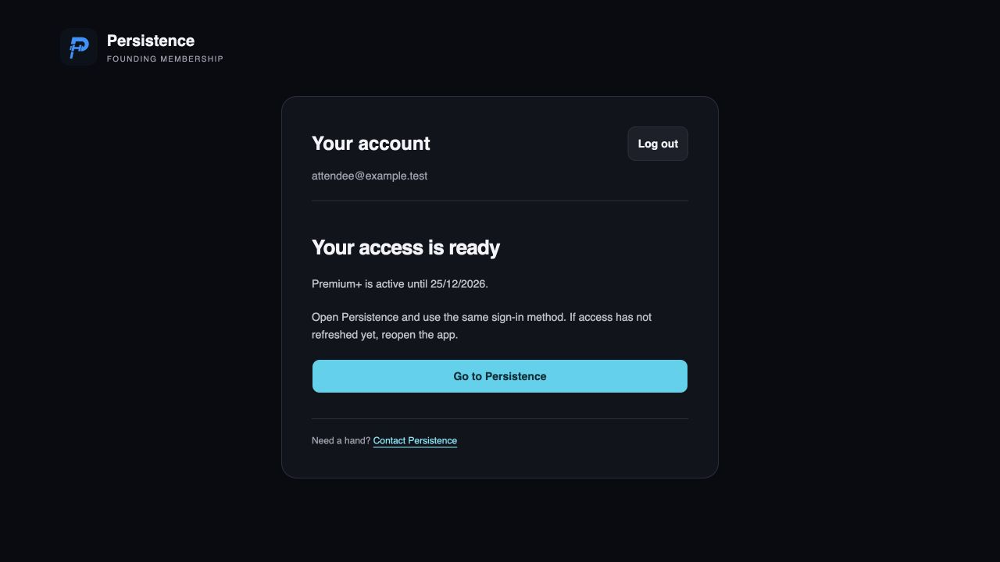
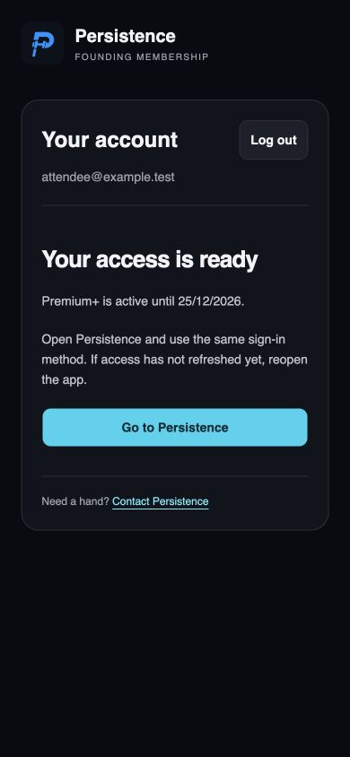

# Apple sign-in and event access — 22 September 2026

## Changes

- Preserve exchanged tokens as a pending session until the authoritative user lookup succeeds. Temporary network, timeout, rate-limit and service failures offer Retry sign-in and can recover after reload without reusing the one-use callback code. Unverified identities never become confirmed sessions; logout invalidates in-flight work.
- Read current subscription access after sign-in. Active access shows the plan and expiry; pending payment shows a pending state. Neither offers duplicate claim/purchase forms. Failed lookups offer retry rather than pretending the account has no access.
- Make required signup profile creation atomic. A conflicting profile email now rolls back signup instead of leaving an orphan auth account. Optional invitation failures remain nonfatal. This does not merge or repair conflicting profiles automatically.

## Evidence and limits

116 focused web tests passed, including first-time Apple ordinary/relay identities, email confirmation, callback proof, StrictMode, post-exchange recovery and membership states. External HTTP is simulated. Changed web files exceed 90% in statements, branches, functions and lines (aggregate 98.98%, 97.19%, 100%, 99.45%).

Nine isolated PGlite tests exercise actual profile migration definitions, including collision rollback and migration reapplication. Added grant lifecycle cases cover grants issued before account creation for Premium and Start Up Coach+, transient identity lookup failure and idempotent activation. These fixtures do not implement Supabase OAuth itself.

Repository typecheck passed. The broad test/build attempt exited 137 during mobile tests and web build under concurrent load; it is not a clean full-suite result. The sequential rerun passed web lint, all 116 focused web tests and the production web build. Targeted backend results are recorded in the PR.

Desktop and 390px mobile access screenshots were inspected and independently reviewed. Local mocked authentication also displayed the retry action after a service failure.

Earlier read-only production checks confirmed signup and Apple are enabled, the web callback uses S256 and the expected return route, and no auth/profile orphans or email mismatches existed at inspection. The reported user's successful retained session was native; the exact failed website step remains unconfirmed. Her previously authorized grant repair is separate from this PR.

No production migration or application deployment was performed. No native app build was initiated.

## Remaining production acceptance test

Use a consenting tester with an Apple ID that has never used Persistence, without first signing into the app. Issue an intended event grant through the normal admin flow before signup.

1. Open https://persistence.evans-software-solutions.com/founding/access in iPhone Safari using the event entry method.
2. Continue with Apple and approve; record time, iOS/browser and final path, never codes/tokens.
3. Verify account and access, then reload. If Hide My Email differs from the granted email, verify the invited email through the normal claim flow.
4. Sign into the app with the same Apple account and verify tier/expiry. Confirm one intended profile and grant-backed subscription.
5. Repeat with a fresh Hide My Email identity. An existing Apple ID in a private tab does not test account creation.

Actual first-consent Apple/iPhone handoff, email delivery and the complete production grant-to-app journey remain unverified.

## Screenshots

