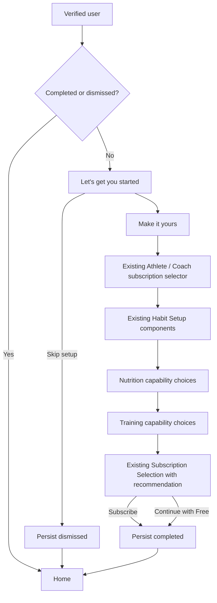

# 31 — Onboarding and experience polish · Design

Status: **Approved for implementation — 2026-08-31**
Companion requirements: `requirements.md`

Approved handoff: `/Users/bradleysimms-evans/Downloads/Persistence Gym Application (3)/`.
The prototype defines composition and interaction; production components and
contracts define implementation detail.

## Experience map



Skip on P–S advances one page. Only the welcome-page Skip dismisses the whole
journey. That action sits at the top right and opens a confirmation warning;
cancel keeps the user on Welcome, while confirmation persists `dismissed` and
opens Home. The journey never auto-runs after either terminal state.

## Reuse boundaries

| Onboarding page               | Production source to reuse                                      |
| ----------------------------- | --------------------------------------------------------------- |
| Let's get you started         | Production Persistence logo + shared onboarding shell           |
| Make it yours                 | Edit Profile fields, validation, update-profile command         |
| How will you use Persistence? | Subscription Selection values/state, rendered as two tiles only |
| Build your daily habits       | HabitSetup container/presenter + configure command              |
| Let's set up your nutrition   | Subscription catalogue capability copy + nutrition routes       |
| Train                         | Subscription catalogue workout limits + Loadout capability copy |
| Recommended plan              | Subscription Selection cards, catalogue, RevenueCat/store flow  |

Onboarding owns orchestration and recorded recommendation intent only. It does
not fork feature data or purchase behaviour.

## Visual direction

Use the existing Persistence foundation:

- background `#0A0B12`, card `#12141D`, elevated `#1A1D29`
- athlete primary `#22D3EE`, coach accent `#A78BFA`, achievement `#F5C518`
- Geist for display/body and Geist Mono for metrics
- production logo asset on the welcome page
- 44pt minimum targets and existing foundation radii/spacing

Subscription recommendation should look like the existing subscription screen.
The only additions are recommendation emphasis, reason copy, and Show other
plans. A trial banner belongs inside the tile above the tier name; the button is
always **Subscribe**.

## State and persistence

```ts
type OnboardingPage =
  | "welcome"
  | "profile"
  | "role"
  | "habits"
  | "nutrition"
  | "train"
  | "recommendation";

type OnboardingIntentKey =
  | "nutrition_barcode"
  | "nutrition_photo_estimate"
  | "nutrition_mealprint"
  | "training_three_workouts"
  | "training_unlimited_workouts"
  | "training_loadout";

type OnboardingState = {
  userId: string;
  version: 1;
  currentPage: OnboardingPage;
  completedPages: OnboardingPage[];
  skippedPages: OnboardingPage[];
  status: "in_progress" | "completed" | "dismissed";
  path: "athlete" | "coach" | null;
  coachClientBand: "1_5" | "6_15" | "16_30" | null;
  intentKeys: OnboardingIntentKey[];
  completedAt: string | null;
  dismissedAt: string | null;
  updatedAt: string;
};
```

The authenticated user ID scopes every read/write. SQLite mirrors the record for
offline resume. `completed` and `dismissed` are terminal for automatic routing.
Settings edit profile/habit/nutrition data but never reset onboarding state.

## Navigation

- Auth/consent resolves first, then onboarding state.
- New `/(onboarding)` route group owns the seven-page orchestration shell.
- Steps use the native horizontal page transition (`slide_from_right`), not a
  full-screen cross-fade.
- The main tabs do not mount behind an unfinished journey.
- Terminal actions use `replace`, preventing Back from reopening onboarding.
- There is no user-facing “replay onboarding” action; Settings exposes the real
  feature settings instead.

## Shared calendar component

Replace DOB's raw text field with a reusable date-only field backed by the
JS-only calendar extracted from Fuel:

```ts
<DatePickerField
  value="1993-05-12"
  maximumDate={today}
  onChange={setDateOfBirth}
  label="Date of birth"
/>
```

Requirements:

- shared React Native presentation with no native dependency or new binary
- month/year navigation suitable for birth dates (no 300-swipe journey)
- locale-aware display, ISO date persistence
- min/max constraints and clear/reset support where the field is optional
- accessible selected-date announcement and labelled navigation
- extracted for reuse by goals, measurements, programme dates, and any existing
  date-only text field when touched

## Profile composition

Extract reusable field groups from Edit Profile rather than embedding one screen
inside another. Both surfaces must share the same values and validation:

- full name and avatar
- DOB via `DatePickerField`
- fitness level
- metabolic sex
- height + height unit
- weight unit

Body weight remains a measurement and is deliberately absent from profile state.

## Recommendation intent

Nutrition and Train show tier-labelled capability rows with check/select state.
Intent is a small onboarding preference record; feature state itself still lives
in existing nutrition/workout systems.

Default athlete selections include photo estimation, Mealprint, unlimited
workouts, and Loadout, so the default athlete recommendation is Premium+.

```ts
recommendOnboardingPlan({
  path,
  coachClientBand,
  intentKeys,
  catalogue,
  currentTier,
}): { tierName: SubscriptionTierName; reasons: string[] }
```

Rules:

- Athlete: lowest live consumer tier covering retained intent; initial state
  resolves to Premium+.
- Coach 1–5: Start Up Coach, upgraded to Start Up Coach+ if adaptive-suite
  intent is selected.
- Coach 6–15: Coach.
- Coach 16–30: Coach Pro.
- Current paid entitlements are respected; never frame a covered capability as
  requiring downgrade/re-purchase.

The final route passes `recommendedTier` and `reasons` into the existing
Subscription Selection state. Show other plans expands existing subscription
cards for that audience. Store/RevenueCat remains authoritative for pricing,
trial banner visibility, purchase, restore, and legal copy.

## Separate body-history routes

Create two routes backed by shared primitives:

- `/(app)/weight-history`
- `/(app)/body-fat-history`

Each route has its own title, summary derivation, graph configuration, empty
state, history rows, and metric-specific log action. Share only internal
`MeasurementChart`, range control, history list, and measurement sheet fields.

Wire the existing `BodyTrendPresenter` Weight and Body Fat cards to distinct
routes. Do not change `HomePresenter` composition.

Graph data sorts by measured timestamp. Canonical weight remains kilograms;
unit conversion is display-only. Multiple same-day measurements remain in the
list; the graph uses the latest same-day point for the selected range.

## Exercise-detail 1RM banner

Keep the normal Exercise Detail hierarchy and insert one banner directly after
the media block:

```text
[exercise image/video]
[Estimated 1RM: 142.5 kg · from 120 kg × 6]
[description / muscles / equipment / instructions]
```

Add a pure service:

```ts
estimateOneRepMax(weightKg: number, reps: number): number | null
```

- reps 1 → actual weight
- reps 2–10 → Epley
- otherwise → null

Exercise detail uses `GET /exercises/:exerciseId/performance-summary`, an
authorised, current-user and exercise-scoped aggregate. It returns actual 10RM,
the heaviest completed set at any positive rep count, best single-set volume,
lifetime exercise volume, estimated 1RM, and estimated 10RM with source-set
provenance where applicable. The backend calculates the summary in one
aggregate query rather than transferring workout history. Cache the full
summary by both user ID and exercise ID.

Actual 10RM is the heaviest completed set of exactly ten repetitions. Set
volume is `weightKg * reps`; lifetime volume sums it across all qualifying
completed weighted sets. `heaviestSet` is the greatest recorded load regardless
of reps, retaining that set's rep count and completion date for a future
"Best set" card. Estimated 10RM reverses Epley from the best estimated 1RM:
`oneRepMaxKg / (1 + 10 / 30)`. Spec 31 renders only the Estimated 1RM banner;
the wider contract is ready for a later stats carousel. Calculation formulae
remain internal and are not rendered on Exercise Detail.

## Coaching contract—not a new dashboard

Current foundations already exist:

- coach Client Detail includes body trend, targets, habits, programme, sessions,
  adherence, briefs/actions, and coach notes
- athlete Training reads active programme, today's work, and habits
- relationship gating decides whether the athlete surface appears

The implementation aligns these existing surfaces:

1. One relationship/assignment contract feeds both sides.
2. Athlete adds coach identity, nutrition target, active goal, and visible brief.
3. Coach retains private notes/actions that never enter the athlete payload.
4. Missing modules render explicit setup/empty states.
5. Cached-active relationship state survives a background refresh.
6. Relationship, programme, workout, habit, nutrition, goal, brief, and
   measurement mutations invalidate both relevant query-key families.

## Exercise ordering

Extend the current creator/editor/active exercise rows with the drag handle.
Reuse `reorderExercises`; add accessible move actions; move supersets as
contiguous blocks. Live order remains session-only. Gesture Handler, Reanimated,
and the root gesture host are already shipped, so this is OTA-compatible and
adds no native dependency.

## Analytics

- `onboarding_page_viewed|completed|skipped`
- `onboarding_dismissed`
- `onboarding_completed`
- `onboarding_intent_changed` (intent key only)
- `onboarding_recommendation_viewed`
- `onboarding_plan_selected`
- `weight_history_opened`
- `body_fat_history_opened`
- `measurement_logged_from_history`
- `estimated_1rm_banner_viewed`
- `coaching_overview_opened`

No names, dates of birth, health values, loads, free text, or client identifiers.

## Bootstrap failure handling

Onboarding state is part of post-auth routing authority. When its initial read
fails and no user-scoped offline mirror exists, AuthGate holds navigation and
renders the shared full-screen error state with Retry. Password recovery,
soft-delete restoration, auth callback, purchase completion, and coach-invite
consent retain priority. A cached onboarding state remains usable offline. The
initial read and retries use a 10-second client timeout; while routing an
unfinished journey, the root retains the branded loader instead of exposing the
underlying route.

API error mapping accepts both application `{ error }` responses and API Gateway
`{ message }` responses, so an HTTP failure is not reduced to an empty
`server: no detail` warning.

## Existing-state audit

| Request                | Existing foundation                              | Required change                         |
| ---------------------- | ------------------------------------------------ | --------------------------------------- |
| One-time onboarding    | No complete journey found                        | New orchestration + terminal state      |
| Profile                | Edit Profile exists; DOB is raw text             | Reuse fields + shared calendar          |
| Athlete/Coach          | Subscription selector exists                     | Reuse in onboarding flow                |
| Habits                 | Habit Setup exists                               | Mount in onboarding mode                |
| Nutrition/Train intent | Catalogue has exact tier features                | Intent UI + recommendation inputs       |
| Recommendation         | Catalogue and purchase routes exist              | Recommendation state + Show other plans |
| Weight/Body Fat        | One combined history list exists                 | Separate routes, graphs, log actions    |
| 1RM                    | PR derivation exists; detail has no user history | Scoped read + one banner                |
| Coaching               | Both sides partially exist                       | Complete shared data/cache contract     |
| Reorder                | Domain helper and gesture stack exist            | OTA-safe block drag/move wiring         |

## Rollout

Onboarding goes live with the application release and has no environment or
feature-flag gate. Every existing or newly created user without a `completed`
or `dismissed` onboarding state enters it automatically. No bulk backfill is
required: absence of a state row means the journey has not started.

Weight, Body Fat, 1RM, coaching, and exercise-ordering changes can ship
independently behind `experience_polish_v1`. The native date-picker dependency
is the only part of this scope that requires a new store build.
